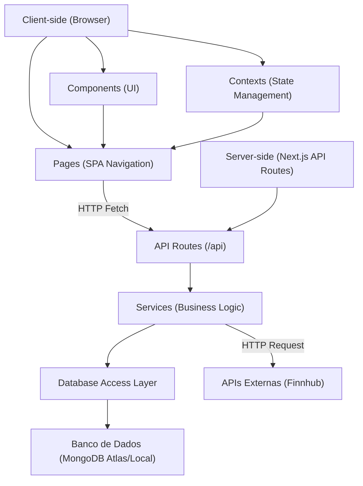
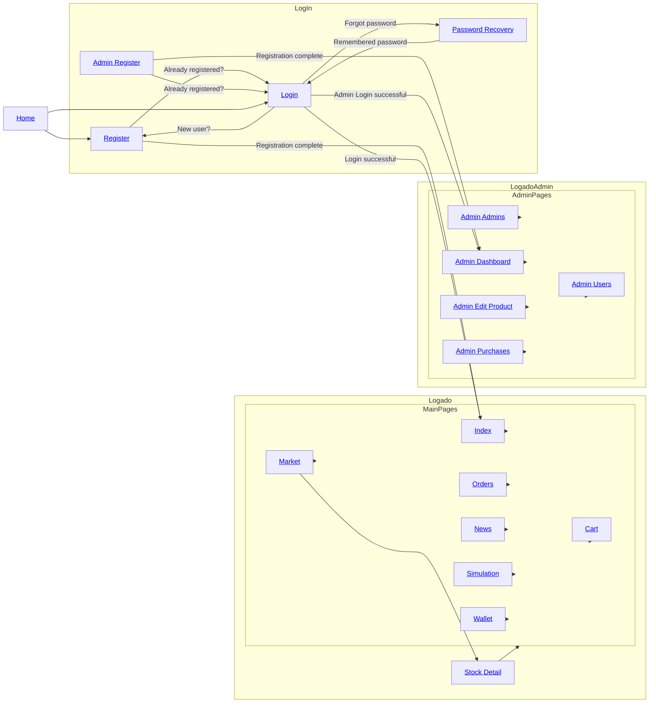
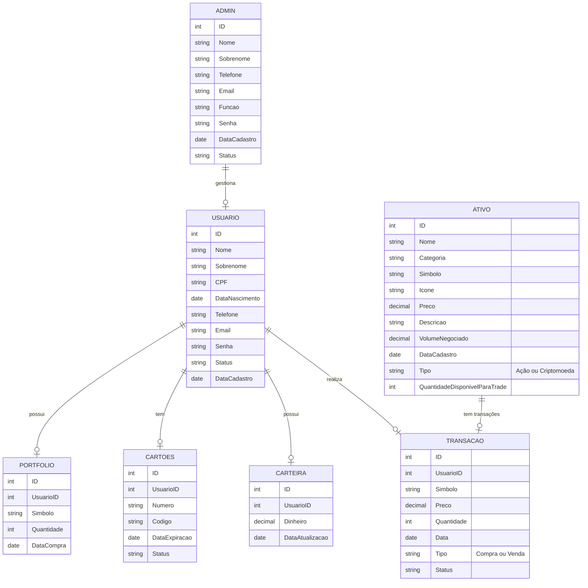

# Relatório do Projeto: OrangeWave - Milestone 2


**Universidade de São Paulo**  
**Instituto de Ciências Matemáticas e de Computação**

**Disciplina:** Introdução ao Desenvolvimento WEB  
**Maio de 2025**

**Grupo:**  
- Christyan Paniago Nantes - 15635906  
- Felipe Volkweis de Oliveira - 14570041  
- Vinicius Gustierrez Neves - 14749363  

---

## Índice
- [1. Requisitos](#requisitos)
- [2. Descrição do Projeto](#descrição-do-projeto)
- [3. Comentários sobre o Código](#comentários-sobre-o-código)
- [4. Plano de Testes](#plano-de-testes)
- [5. Resultados dos Testes](#resultados-dos-testes)
- [6. Procedimentos de Build](#procedimentos-de-construção)
- [7. Problemas Encontrados](#problemas-encontrados)
- [8. Comentários Adicionais](#comentários-adicionais)

---

# Introdução - OrangeWave

**Plataforma de Simulação de Investimentos**  

Este projeto consiste em uma **corretora virtual de ações e criptomoedas**, desenvolvida como parte do trabalho final da disciplina. Diferente de um e-commerce tradicional, a plataforma simula operações de compra e venda de ativos financeiros em tempo real, utilizando APIs de mercado (como Finnhub) para dados autênticos, porém **sem transações reais**.  

**Objetivos Principais:**  
- Proporcionar uma experiência educativa sobre o mercado financeiro.  
- Cumprir os requisitos do curso (como CRUD de produtos e carrinho de compras) através de adaptações criativas:  
  - *Produtos* → Ações/criptomoedas.  
  - *Carrinho* → Ordens de trade pendentes.  
  - *Pagamento* → Confirmação com cartão fictício.  
- Oferecer funcionalidades exclusivas, como **simulador de estratégias** e **visualização de notícias relevantes aos Trades**.  

**Público-Alvo:**  
- Estudantes de finanças.  
- Iniciantes no mercado de investimentos.  

**Tecnologias-Chave:**  
- Vite
- TypeScript
- React
- Tailwind CSS
- Dados em tempo real: APIs Finnhub.  

## Requisitos

### 1.1 Requisitos Funcionais
**Tipos de Usuários:**  
- **Clientes (Investidores):**  
  - Cadastrar-se e fazer login.  
  - Visualizar dados de ações/criptomoedas em tempo real (via API Finnhub).  
  - Simular ordens de compra/venda com valor da carteira ou com cartão de crétido fictício.  
  - Acessar portfólio e histórico de transações.
  - Adcionar e remover dinheiro da carteira.
  - Acompanhar notícias do mercado financeiro.
- **Administradores:**  
  - Gerenciar ativos listados (adicionar/editar ações/criptomoedas).  
  - Adicionar e remover outros administradores.
  - Visualizar dados de atividade dos usuários.  

**Funcionalidades Principais:**  
- **Listagem de Ativos:**  
  - Exibir ativos (nome, símbolo, logo, preço atual, variação 24h).  
  - Filtros por tipo (ações/cripto), volatilidade ou setor.  
- **Simulação de Trading:**  
  - Interface de "Comprar/Vender" com seletor de quantidade (substitui o "carrinho").  
  - Confirmação de pagamento simulado (solicitar número de cartão fictício).  
- **Acompanhamento de Portfólio:**  
  - Mostrar saldo virtual, ativos adquiridos e lucro/prejuízo.  
- **Painel do Administrador:**  
  - CRUD de ativos.  

#### 1.2 Requisitos Não-Funcionais 
- **Desempenho:**  
  - Dados da API atualizados a cada 30 segundos (simular tempo real).  
- **Usabilidade:**  
  - Design responsivo (mobile/desktop).  
  - Navegação intuitiva em SPA (sem recarregar a página).  
- **Acessibilidade:**  
  - Contraste adequado e labels para leitores de tela.  
- **Segurança:**  
  - Autenticação básica.  

#### 1.3 Adaptações 
- **Funcionalidade Extra:**  
  - Simulador de estratégias com dados históricos (diferencial).  
  - Display de notícias relevantes para Trading

---

## Descrição do Projeto
### **Projeto: OrangeWave**  

Este projeto consiste em uma **corretora virtual de ações e criptomoedas**, desenvolvida como trabalho final de disciplina. A plataforma permite que usuários simulem operações de compra e venda de ativos financeiros utilizando dados em tempo real de APIs como **Finnhub**, sem envolver transações reais.  

---

### Funcionalidades

### Área do Cliente 
- **Index** (`index.html`): Página inicial
- **Mercado** (`market.html`): Visualização de ações e criptomoedas com filtros.  
- **Detalhes do Ativo** (`stock-detail.html`): Gráficos de preço, histórico e opção de compra/venda.  
- **Carteira** (`wallet.html`): Saldo virtual e portfólio de investimentos.  
- **Carrinho** (`cart.html`): Confirmação de ordens com cartão fictício.  
- **Notícias** (`news.html`): Feed de notícias financeiras (integrado à API).  
- **Histórico** (`orders.html`): Registro de transações simuladas.  
- **Simulador de Estratégias** (`simulation.html`): Teste de estratégias com dados históricos.  

### Área do Administrador 
- **Dashboard** (`admin-dashboard.html`): Visão geral de usuários e movimentações.  
- **Cadastro de Ativos** (`admin-edit-product.html`): CRUD de ações/criptomoedas.  
- **Cadastro de Novos Admins** (`admin-register.html`): Criação de novos administradores.  
- **Ver Histórico de Compras** (`admin-purchases.html`): Visualizar compras de ações/criptomoedas dos usuários.  
- **Gerenciamento de Admins** (`admin-admins.html`): Lista e gerenciamento de administradores.  
- **Gerenciamento de Usuários** (`admin-users.html`): Visualização e controle de usuários registrados.  

### Funcionalidades Compartilhadas 
- **Homepage** (`home.html`): Homepage da aplicação
- **Autenticação** (`login.html`, `register.html`, `password-recovery.html`): Fluxo completo de login e cadastro.

---

### Arquitetura do Sistema

### Fluxo de Navegação


---

### Diagrama de Entidade Relacionamento


## Comentários sobre o Código
- TBD

## Plano de Testes
- TBD

## Resultados dos Testes
- TBD

## Procedimentos de Build
- TBD

## Problemas Encontrados
- TBD

## Comentários Adicionais
- TBD


## How can I edit this code?

There are several ways of editing your application.

**Use your preferred IDE**

If you want to work locally using your own IDE, you can clone this repo and push changes.

The only requirement is having Node.js & npm installed - [install with nvm](https://github.com/nvm-sh/nvm#installing-and-updating)

Follow these steps:

```sh
# Step 1: Clone the repository using the project's Git URL.
git clone <YOUR_GIT_URL>

# Step 2: Navigate to the project directory.
cd <YOUR_PROJECT_NAME>

# Step 3: Install the necessary dependencies.
npm i

# Step 4: Start the development server with auto-reloading and an instant preview.
npm run dev
```

