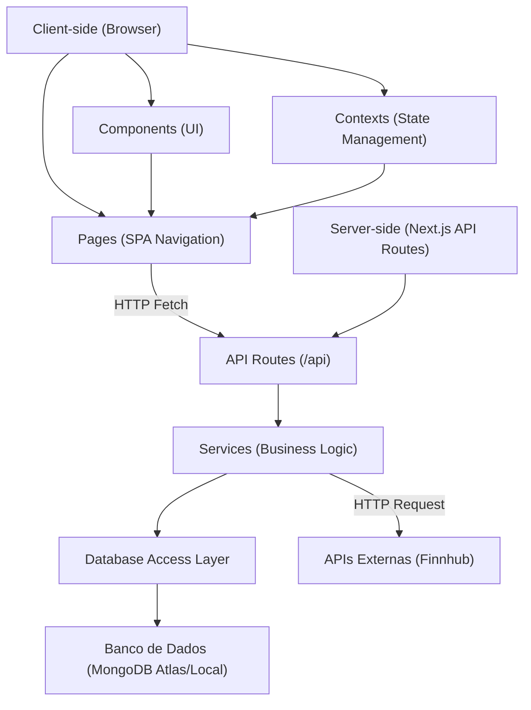
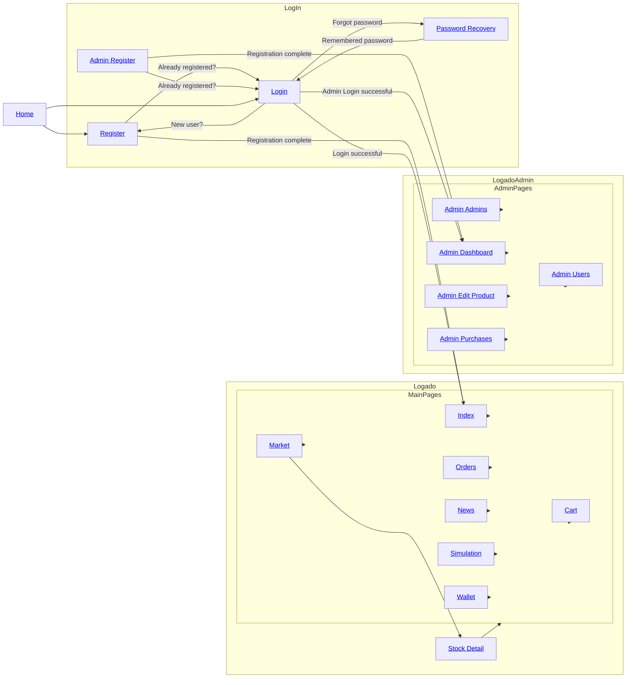
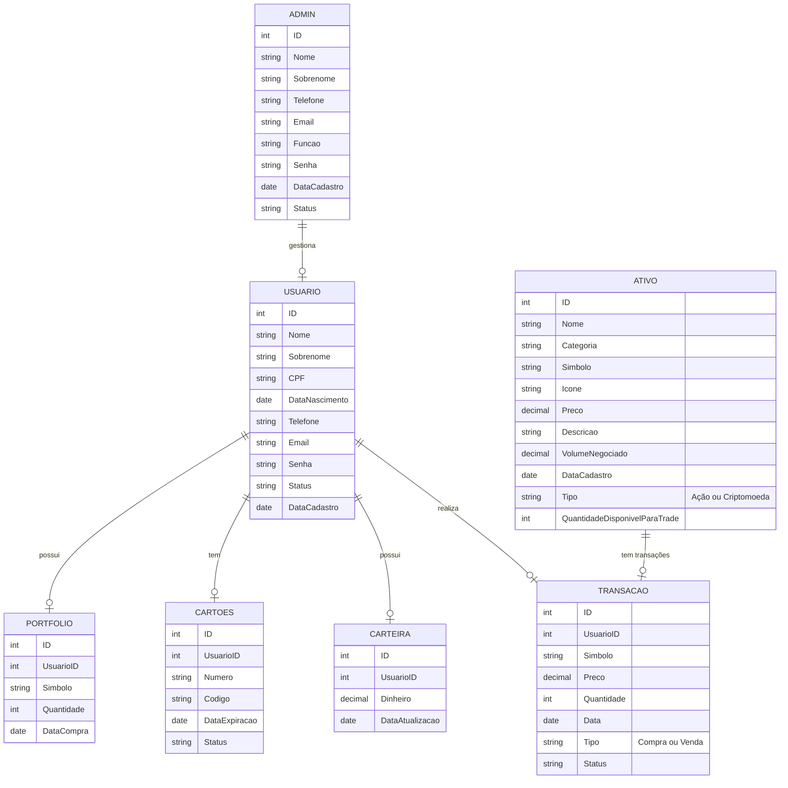

# Relatório do Projeto: OrangeWave - Milestone 2


**Universidade de São Paulo**  
**Instituto de Ciências Matemáticas e de Computação**

**Disciplina:** Introdução ao Desenvolvimento WEB  
**Maio de 2025**

**Grupo:**  
- Christyan Paniago Nantes - 15635906  
- Felipe Volkweis de Oliveira - 14570041  
- Vinicius Gustierrez Neves - 14749363  

---

## Índice
- [1. Requisitos](#requisitos)
- [2. Descrição do Projeto](#descrição-do-projeto)
- [3. Comentários sobre o Código](#comentários-sobre-o-código)
- [4. Plano de Testes](#plano-de-testes)
- [5. Resultados dos Testes](#resultados-dos-testes)
- [6. Integração com Beeceptor](#integração-com-beeceptor)
- [7. Procedimentos de Build](#procedimentos-de-build)
- [8. Problemas Encontrados](#problemas-encontrados)
- [9. Comentários Adicionais](#comentários-adicionais)

---

# Introdução - OrangeWave

**Plataforma de Simulação de Investimentos**  

Este projeto consiste em uma **corretora virtual de ações e criptomoedas**, desenvolvida como parte do trabalho final da disciplina. Diferente de um e-commerce tradicional, a plataforma simula operações de compra e venda de ativos financeiros em tempo real, utilizando APIs de mercado (como Finnhub) para dados autênticos, porém **sem transações reais**.  

**Objetivos Principais:**  
- Proporcionar uma experiência educativa sobre o mercado financeiro.  
- Cumprir os requisitos do curso (como CRUD de produtos e carrinho de compras) através de adaptações criativas:  
  - *Produtos* → Ações/criptomoedas.  
  - *Carrinho* → Ordens de trade pendentes.  
  - *Pagamento* → Confirmação com cartão fictício.  
- Oferecer funcionalidades exclusivas, como **simulador de estratégias** e **visualização de notícias relevantes aos Trades**.  

**Público-Alvo:**  
- Estudantes de finanças.  
- Iniciantes no mercado de investimentos.  

**Tecnologias-Chave:**  
- Vite
- TypeScript
- React
- Tailwind CSS
- Dados em tempo real: APIs Finnhub.  

## Requisitos

### 1.1 Requisitos Funcionais
**Tipos de Usuários:**  
- **Clientes (Investidores):**  
  - Cadastrar-se e fazer login.  
  - Visualizar dados de ações/criptomoedas em tempo real (via API Finnhub).  
  - Simular ordens de compra/venda com valor da carteira ou com cartão de crétido fictício.  
  - Acessar portfólio e histórico de transações.
  - Adcionar e remover dinheiro da carteira.
  - Acompanhar notícias do mercado financeiro.
- **Administradores:**  
  - Gerenciar ativos listados (adicionar/editar/remover ações/criptomoedas).  
  - Adicionar e remover outros administradores e clientes.
  - Visualizar dados dos usuários e transações na plataforma.
  - Exportar dados para arquivos CSV.  

**Funcionalidades Principais:**  
- **Listagem de Ativos:**  
  - Exibir ativos (nome, símbolo, logo, preço atual, variação 24h).  
  - Filtros por tipo (ações/cripto), volatilidade ou setor na aba de mercado.  
- **Simulação de Trading:**  
  - Interface de "Comprar/Vender" com seletor de quantidade (substitui o "carrinho").  
  - Operações de compras e venda de ativos simulado em tempo real, de forma a permitir a avaliaççao de habilidades de trading de ativos.
  - Saldo fictício e persistência de posição ao longo da simulação. 
- **Acompanhamento de Portfólio:**  
  - Mostrar saldo virtual da carteira, ativos adquiridos e lucro/prejuízo em cada um.  
- **Painel do Administrador:**  
  - CRUD de ativos e de usuários da plataforma.
- **Carrinho:**
  - Compra de ativos utilizando saldo da plataforma ou cartão de crédito.
  - Limitação do valor de compras com saldo da conta.
  - Limitação da quantidade a ser comprada baseando-se no estoque do produto.
- **Ativos e carteira da plataforma:**
  - Venda de ativos possuídos, com acrescimento do valor de venda no saldo da plataforma.
  - Possibilidade de depósito e saque do valor da conta.
- **Controle de histórico:**
  - Histórico de saques e depósitos.
  - Histórico de compra e venda de ativos.
- **Controle de estoque:**
  - Cada ativo possui um estoque, que é decrescido ao realizar compras e acrescido quando o usuário realiza vendas de ativos comprados.
  - O site bloqueia compras quando o produto está fora de estoque.

#### 1.2 Requisitos Não-Funcionais 
- **Usabilidade:**  
  - Design responsivo (mobile/desktop).  
  - Navegação intuitiva.  
- **Acessibilidade:**  
  - Contraste adequado e labels para leitores de tela.  
- **Segurança:**  
  - Autenticação básica com e-mail e senha.  

#### 1.3 Adaptações 
- **Funcionalidade Extra:**  
  - Simulador de estratégias/trading com dados históricos (diferencial).  
  - Display de notícias relevantes para Trading (diferencial).
  - Exportação de dados CSV da plataforma pelo ADMIN (ativos e transações).

---

## Descrição do Projeto
### **Projeto: OrangeWave**  

Este projeto consiste em uma **corretora virtual de ações e criptomoedas**, desenvolvida como trabalho final de disciplina. A plataforma permite que usuários simulem operações de compra e venda de ativos financeiros utilizando dados em tempo real de APIs como **Finnhub**, sem envolver transações reais.  

---

# Estrutura de Páginas (.tsx)

A seguir estão as páginas do projeto organizadas por áreas, com todos os arquivos convertidos para `.tsx` e nomeados com letras maiúsculas no estilo PascalCase.

### Área do Cliente 
- **Index** (`Index.tsx`): Página inicial  
- **Mercado** (`Market.tsx`): Visualização de ações e criptomoedas com filtros.  
- **Detalhes do Ativo** (`StockDetail.tsx`): Gráficos de preço, histórico e opção de compra/venda.  
- **Carteira** (`Wallet.tsx`): Saldo virtual e portfólio de investimentos.  
- **Carrinho** (`Cart.tsx`): Confirmação de ordens com cartão fictício.  
- **Notícias** (`News.tsx`): Feed de notícias financeiras (integrado à API).  
- **Histórico** (`Orders.tsx`): Registro de transações simuladas.  
- **Simulador de Estratégias** (`Simulation.tsx`): Teste de estratégias com dados históricos.  

### Área do Administrador 
- **Dashboard** (`Dashboard.tsx`): Visão geral de usuários e movimentações.  
- **Cadastro de Ativos** (`Carts.tsx`): Visualização de carrinhos abertos
- **Cadastro de Novos Admins** (`Stocks.tsx`): CRUD de ações/criptomoedas  
- **Gerenciamento de Admins** (`Transactions.tsx`):  Visualizar compras de ações/criptomoedas dos usuários.   
- **Gerenciamento de Usuários** (`Users.tsx`): Visualização e controle de usuários e administradores registrados.  

### Funcionalidades Compartilhadas 
- **Homepage** (`Home.tsx`): Homepage da aplicação  
- **Autenticação** (`Login.tsx`, `Register.tsx`): Fluxo completo de login e cadastro.  


---

### Arquitetura do Sistema

### Fluxo de Navegação


---

### Diagrama de Entidade Relacionamento


## Comentários sobre o Código

A aplicação foi construída com foco em modularidade e reutilização de componentes React, utilizando **Context API** para gerenciamento eficiente de estado global (como autenticação, saldo da carteira, ordens em aberto e portfólio). O projeto é completamente client-side, com lógica local que simula operações de backend, conforme especificado no enunciado.

### Estrutura e Organização:

- Utilização de **componentes funcionais com React + TypeScript**.
- Requisições `fetch` bem estruturadas, centralizadas em arquivos de serviços, mesmo em endpoints simulados (via Beeceptor).
- Estilização com **Tailwind CSS**, permitindo responsividade e boa usabilidade.

### Armazenamento dos Dados:

Optamos por **não utilizar o `localStorage`** para persistência de dados e sim utilizar **variáveis locais de estado gerenciadas por Context API**. Esta decisão foi tomada por alguns motivos específicos:

- O enunciado da atividade sugere simular funcionalidades de servidor **sem necessidade real de backend**, permitindo uso de mocks. A persistência longa de dados (como via `localStorage`) não era requisito.
- O uso de **variáveis em contexto** foi suficiente para garantir a persistência de dados dentro de uma sessão e permitiu maior controle dos fluxos de teste (simulando banco de dados em memória).
- Dados sensíveis ou críticos (como autenticação) foram mantidos em um BaaS (Backend As a Service) com o Supabase, de forma que não exigem armazenamento local, permitindo a melhor persistência do login do usuário e diferenciação entre usuários clientes e usuários admnistradores já no momento do login.
- O foco foi em garantir o **comportamento funcional esperado**, não a durabilidade entre sessões, uma vez que os testes visam validar a lógica de operações e não o armazenamento perene.

Se necessário, seria trivial adaptar o código para salvar em `localStorage`, mas isso não agregaria tanto valor ao projeto quanto todas as funcionalidades extras desenvolvidas (venda de ativos, saldo simulado na plataforma, feed de notícias, simulaçao de trading e exportação de dados em CSV) ou aos testes solicitados na entrega da Milestone 2.

### Considerações Técnicas

- A estratégia de mocks foi adotada com endpoints em Beeceptor para simular a persistência de ações como **compra, venda e atualização de estoque**.
- Dados de autenticação, carteira, histórico e portfólio são tratados de forma local via React Context, garantindo uma experiência fluida e sem dependência de backend.
- Em um cenário real, a separação entre front e backend ocorreria com APIs REST completas e autenticação segura; para esta entrega, a abordagem foi abstraída e mantida client-side para foco no comportamento da aplicação.

---

## Plano de Testes

Abaixo estão listadas as principais funcionalidades testadas, com foco tanto nas ações do usuário comum quanto nas funcionalidades administrativas. Todos os testes foram realizados localmente com dados mantidos via Context API (sem persistência em `localStorage` ou backend real), simulando comportamento de um sistema completo.

### Funcionalidades a serem testadas (Usuário):
- **Adição de ativos ao carrinho com limite de estoque**  
  - Esperado: impedir adição acima da quantidade disponível.
- **Ajuste de quantidade no carrinho (aumento, diminuição, exclusão)**  
  - Esperado: atualização automática do valor total e quantidade selecionada.
- **Compra com saldo da carteira**  
  - Esperado: falha caso o valor total ultrapasse o saldo ou o estoque; sucesso se dentro dos limites. Estoque e histórico são atualizados.
- **Compra com cartão de crédito (sem limite de saldo)**  
  - Esperado: transação permitida se houver estoque; atualiza histórico e estoque.
- **Venda de ativos adquiridos**  
  - Esperado: acréscimo ao saldo virtual, redução proporcional no portfólio, atualização do histórico e aumento do estoque.
- **Inserção e remoção de valores na carteira**  
  - Esperado: saldo atualizado em tempo real; impedir retirada acima do saldo.
- **Exibição de notícias do mercado**  
  - Esperado: carregar feed com títulos e links integrados à API.

### Funcionalidades a serem testadas (Administrador):
- **CRUD de Ativos (ações e criptomoedas)**  
  - Esperado: inclusão, edição e exclusão corretas; refletidas imediatamente nas telas de mercado e estoque.
- **CRUD de Usuários e Administradores**  
  - Esperado: visualizar usuários, editar status, cadastrar e excluir contas com efeito imediato nos dados simulados.
- **Visualização de movimentações e exportações**  
  - Esperado: painel de transações, filtro por tipo e exportação em formato CSV funcionando corretamente.
- **Validação de acesso restrito a administradores**  
  - Esperado: bloqueio de rotas exclusivas quando logado como cliente comum ou não autenticado.

> Obs: todos os dados são armazenados temporariamente via Context API e simulação de chamadas mockadas, como orientado pelo enunciado do trabalho. Não há persistência entre sessões.

---

## Resultados dos Testes

| Cenário de Teste | Resultado Esperado | Exemplo |
|------------------|--------------------|---------|
| Adição acima do estoque | Bloqueia ação e exibe alerta | Estoque: 200, tentativa: 250 → ⚠️ erro |
| Diminuição de quantidade | Subtotal e estoque ajustados corretamente | De 160 para 40, estoque volta a 160 |
| Compra com saldo suficiente | Transação bem-sucedida, histórico atualizado | Saldo: R$1000, compra: R$414 → saldo: R$586 |
| Compra com saldo insuficiente | Bloqueia compra com alerta | Saldo: R$200, compra: R$414 → ⚠️ erro |
| Compra com cartão (estoque disponível) | Compra autorizada, estoque ajustado | Cartão → compra de 3 ativos (estoque 5) → OK |
| Venda de ativos | Carteira atualizada, ativo removido do portfólio | Venda de 2 ações → +R$828, -2 ativos |
| Inserção de saldo | Saldo incrementado instantaneamente | +R$500 → saldo atualizado |
| Remoção de saldo | Redução até limite zero permitida | -R$200 → saldo atualizado |
| Criação de novo ativo (admin) | Ativo visível imediatamente no mercado | Novo ativo: "Tesla" → exibido em `Market.tsx` |
| Edição de ativo existente (admin) | Mudanças refletidas em tempo real | Alterar preço de "Apple" → atualizado |
| Exclusão de ativo (admin) | Remoção imediata da listagem | "Bitcoin" excluído → removido do painel |
| Registro de novo administrador | Login e acesso restrito funcionando | admin2@gmail.com → redirecionado para `Dashboard` |
| Exportação de transações | CSV gerado corretamente | 10 transações → CSV baixado com colunas válidas |

---

---

## Integração com Beeceptor

Para simular requisições reais sem backend, foi utilizada a ferramenta Beeceptor com dois endpoints principais:

### GET `/produto/123`

- Usado em `AssetDetail.tsx` para obter dados estáticos do ativo.
- Configuração:
  - Método: **GET**
  - Path: **/produto/123**
  - Corpo de resposta:
```json
{
  "id": "123",
  "name": "Microsoft",
  "price": 414.28,
  "stock": 190
}
```

#### Resultado esperado (exemplo):


### POST `/product/:id`

- Usado em `Cart.tsx` ao confirmar compra.
- Resposta dinâmica com cálculo automático da nova quantidade.
- Configuração no Beeceptor:
  - **Método:** `POST`
  - **Path:** `/product/:id`
  - **Response headers:**
    ```json
    {
      "Content-Type": "application/json"
    }
    ```
  - **Response body:**
    ```json
    {
      "id": "{{body 'productId'}}",
      "name": "{{body 'nameProduct'}}",
      "price": "{{body 'price'}}",
      "stock": "{{body 'stock'}}",
      "quantity": "{{body 'quantity'}}",
      "new_quantity": "{{subtract (body 'stock') (body 'quantity')}}"
    }
    ```

#### Resultado esperado (exemplo):


---

## Procedimentos de Build:

O único requisito é ter o Node.js e o npm instalados - [instalar com nvm](https://github.com/nvm-sh/nvm#installing-and-updating)

Siga os seguintes passos:

```sh
# Etapa 1: Clone o repositório usando a URL do Git do projeto.
git clone [<SUA_URL_GIT>](https://github.com/Vinicius-GN/Orange_Wave-Platform)

# Etapa 2: Navegue até o diretório do projeto.
cd Orange_Wave-Platform

# Etapa 3: Instale as dependências necessárias.
npm install

# Etapa 4: Inicie o servidor de desenvolvimento com recarregamento automático e visualização instantânea.
npm run dev
```
- Faça login na plataforma com o usuário "grupo@gmail.com" e "senha123" para acessar as funcionalidades de usuário
- Faça login na plataforma com o usuário "admin@gmail.com" e "senha123" para acessar as funcionalidades de administrador


